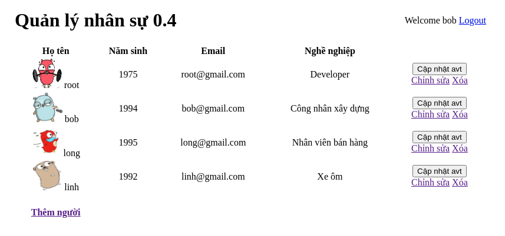

# iris-demo

Một ứng dụng web sử dụng Iris framework

## Chạy thử

1. Clone repo bằng lệnh `git clone https://github.com/LinkK9/iris-demo.git`
2. `cd iris-demo`
3. `go run main.go`

## App flow

Màn hình trang chủ khi chưa đăng nhập, user chỉ có thể xem danh sách hiển thị tên người dùng.\
 \
Đăng nhập với email là tên người dùng + `@gmail.com` với password là `1`.\
 \
Màn hình trang chủ khi đã đăng nhập: \
 \

Ứng dụng có tính năng phân quyền sử dụng. Ở đây đang đăng nhập tài khoản bob, tk này có role là `STUDENT`, role này chỉ có quyền được xem danh sách nhân sự chi tiết mà không thể can thiệp vào thêm, sửa hay xóa nhân sự trong list. Nếu không thực hiện đúng role của mình thì khi chạy tác vụ sẽ báo lỗi:

 \
Tài khoản `linh` có full quyền thêm sửa xóa nhân sự, cập nhật avatar (nhấn vào avatar chọn ảnh rồi nhấn cập nhật).

Ứng dụng này có các role sau đây:

1. User không đăng nhập chỉ được xem danh sách tên, tìm kiếm theo tên
2. 'STUDENT' được phép xem danh sách chi tiết gồm tên, ngày sinh, giới tính, nghề nghiệp
3. 'SALE' được phép tạo mới Person,upload ảnh, cập nhật nhưng không được xoá
4. 'Editor' được phép thêm, sửa, xoá Person
